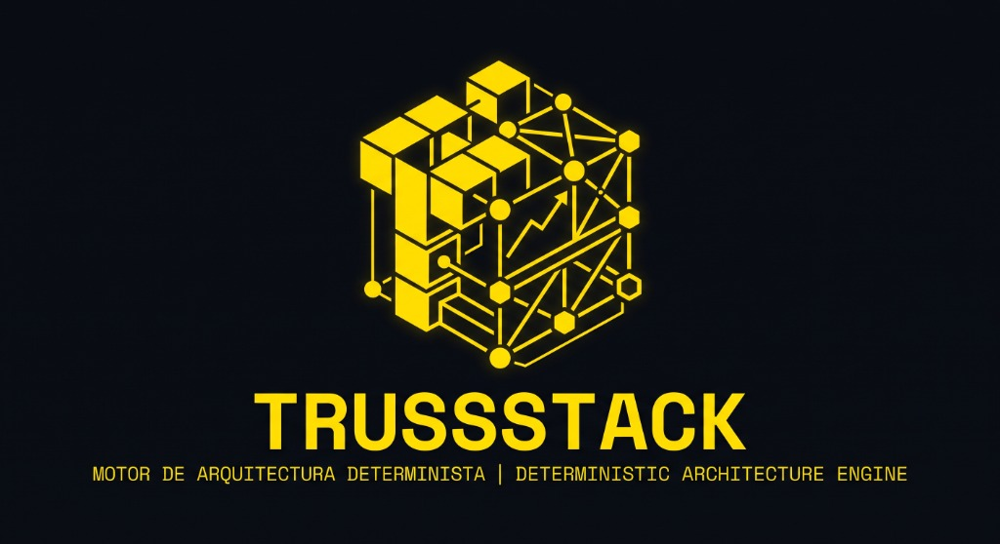

# TRUSSSTACK // Technical Architecture & Trade-off Engine

<p align="center">
  
</p>

<p align="center">
  <strong>MOTOR DE ARQUITECTURA DETERMINISTA // DETERMINISTIC ARCHITECTURE ENGINE</strong><br>
  Plataforma técnica para el diseño, simulación de trade-offs, auditoría de drift y exportación de stacks de software modernos.
</p>

<p align="center">
  <a href="https://github.com/luisrodriguez-rgb/TrussStack"></a>
  <a href="https://github.com/luisrodriguez-rgb/TrussStack/blob/main/LICENSE"></a>
  
  
  
  
</p>

---

## Que es TrussStack

**TrussStack** es un motor técnico determinista de arquitectura de software disenado para ingenieros que necesitan tomar decisiones de stack fundamentadas, reproducibles y explicables. 

A diferencia de catálogos pasivos o asistentes basados en LLMs propensos a alucinaciones y sesgos comerciales, TrussStack evalúa matrices de compatibilidad matemática, calcula penalizaciones de fricción entre capas, proyecta costes reales de infraestructura (incluyendo trampas de transferencia saliente / egress), audita el drift de dependencias en `package.json` mediante CI/CD y genera documentación formal conforme al estándar **MADR 3.0**.

Construido con una estética **Modern-Retro** de alto contraste (amarillo técnico `#FFD000` y negro carbón `#090B10`), tipografía monoespaciada, soporte completo de **Modo Oscuro / Modo Claro**, **Modo Bilingüe (Español / Inglés)** en tiempo real y **cero emojis**.

---

## Filosofia de Ingenieria: Que Hace y Que NO Hace

| [ + ] LO QUE HACE TRUSSSTACK | [ ! ] LO QUE NO HACE TRUSSSTACK |
| :--- | :--- |
| **Evaluacion Determinista Tipada**: Algoritmos en TypeScript con 0 ms de latencia y resultados reproducibles sin llamadas lentas a APIs externas. | **Cero Alucinaciones de IA**: No genera recomendaciones aleatorias ni se basa en cadenas de texto no estructuradas de LLMs. |
| **Deteccion de Fricciones & Costes Ocultos**: Alerta inmediata de incompatibilidades reales (ej. Astro + Auth.js) y trampas de egress de ancho de banda. | **Cero Sesgo Comercial**: Ninguna tecnologia paga por posicionamiento ni existen enlaces patrocinados u ocultos de afiliados. |
| **Telemetria de Benchmarks Empiricos**: Tiempos medidos de arranque en frio (cold starts), tamano de bundle transferido y memoria en reposo. | **No Infla el Boilerplate**: No te obliga a crear proyectos gigantescos ni genera codigo basura que nadie entiende. |
| **Estandar MADR 3.0 & DevOps Scaffolding**: Exporta registros formales de decision (`ARCHITECTURE-ADR.md`), `docker-compose.yml` y `.env.example`. | **No Ignora la Realidad Operativa**: No oculta el coste a 3 anos de mantenimiento ni la complejidad de mantener clusters. |
| **Auditoria GitOps en CI/CD**: Compara tu arquitectura declarada contra tu `package.json` y rompe el build si existe drift no autorizado. | **No Impone Microservicios**: Reconoce cuándo un monolito modular o una arquitectura serverless edge es la opcion correcta para tu fase. |

---

## El Ciclo de Vida Tecnico en 4 Pasos

TrussStack estructura el diseno de software en cuatro etapas metodologicas rigurosas:

```text
[ 01. ESPECIFICAR ]  ──>  [ 02. EVALUAR & DISENAR ]  ──>  [ 03. COMPARAR & BENCHMARKS ]  ──>  [ 04. AUDITAR & CONSTRUIR ]
   Requisitos, Escala        Topologia 5 Capas,          Radar de Arquetipos,              Linter de Drift GitOps,
   y Presupuesto Real        Sustitucion & Protocolos    Costes & Telemetria Empirica      MADR 3.0 & Docker-Compose
```

### Paso 1: Especificar ([Requisitos])
Define parámetros críticos del proyecto entre **12 arquetipos de sistemas modernos** (B2B SaaS, E-Commerce, Backoffice, Microservicios API, Blog/SEO, Colaborativo Real-Time, Agentes de IA/RAG, Apps Móviles, Data Pipelines OLAP, Telemetría IoT, Marketplaces y Servidores de Videojuegos) organizados por categorías con auto-calibración de restricciones recomendadas, escala esperada (1k a 100k+ MAU), tamaño de equipo y presupuesto mensual ($0 strict free tier a crecimiento).

### Paso 2: Evaluar & Disenar ([Arquitectura Canvas])
Explora la topología del sistema organizada en 5 capas desacopladas con 26+ componentes auditados. Inspecciona el **Fit Score global**, la compatibilidad cruzada, las fricciones detectadas y el coste mensual proyectado. Permite la **sustitución de componentes en caliente** con cálculo instantáneo del balance de compromisos (*trade-offs* en el frente de Pareto).

### Paso 3: Comparar & Benchmarks ([Comparar] & [Benchmarks])
Contrasta arquetipos cara a cara entre **6 arquetipos fundamentales** (*Fullstack SaaS*, *Decoupled VPS*, *Edge Static*, *AI Agent Vector*, *Async Event-Driven* y *Local-First SQLite*) mediante un radar multicriterio de 6 dimensiones. Analiza métricas empíricas de benchmarks (arranques en frío en milisegundos, tamaño de bundle en kB, peticiones por segundo y consumo de memoria) y evalúa la viabilidad operativa de auto-hospedar herramientas (*Self-Hosting vs Managed Cloud*).

### Paso 4: Auditar & Construir ([Explorar] & [Exportar])
Descarga el bundle de producción con documentación formal MADR 3.0, configuración ejecutable de contenedores `docker-compose.yml`, archivo de variables `.env.example` y diagramas vectoriales para Mermaid y Excalidraw. Conecta el linter GitOps a tu repositorio para auditar desvíos entre la arquitectura planeada y el `package.json` en cada Pull Request.

---

## Caracteristicas de la Plataforma

### 1. Catalogo de 179 Tecnologias en 13 Dominios Tecnicos
Organización modular desacoplada con protocolos explícitos de red y evaluación paramétrica:
1. **[ 01 ] Ingress & Client Interface (15)**: Next.js, React + Vite, Astro, SvelteKit, Remix, Nuxt, SolidStart, Qwik City, Angular, Vue 3, TanStack Start, HTMX, Preact, Alpine.js, Web Components.
2. **[ 02 ] Application Engine & Business Logic (18)**: Node.js (Express), NestJS, FastAPI, Go (Gin/Fiber), Hono, Django, Ruby on Rails, Spring Boot, ASP.NET Core, Laravel, Elixir (Phoenix), Rust (Actix-web), Rust (Axum), Bun, Deno, ElysiaJS, Fiber (Go), Fastify.
3. **[ 03 ] Persistence, Database & State (21)**: PostgreSQL, Supabase Postgres, Neon, PlanetScale, Turso (libSQL), MongoDB, Redis, MySQL, SQLite, DynamoDB, Cassandra, ClickHouse, Dragonfly, Keyv, SurrealDB, Couchbase, ScyllaDB, TiDB, CockroachDB, Nhost, Aiven.
4. **[ 04 ] Authentication & Identity (12)**: Clerk, Auth.js (NextAuth), Better Auth, Supabase Auth, Auth0, Kinde, Logto, WorkOS, Stytch, Descope, Firebase Auth, Keycloak.
5. **[ 05 ] Storage & CDN (12)**: Cloudflare R2, AWS S3, Supabase Storage, UploadThing, Cloudinary, Backblaze B2, ImageKit, Uploadcare, Filestack, MinIO, Google Cloud Storage, Azure Blob.
6. **[ 06 ] Cloud Hosting & Compute (15)**: Vercel, Cloudflare Pages, Render, Fly.io, Railway, Hetzner Cloud, Netlify, Koyeb, Northflank, AWS ECS / Fargate, Google Cloud Run, DigitalOcean App Platform, Scaleway, Linode (Akamai), Coolify.
7. **[ 07 ] Payments & Monetization (10)**: Stripe, Lemon Squeezy, Paddle, Mercado Pago, PayPal, Chargebee, Braintree, Dodo Payments, Mollie, Adyen.
8. **[ 08 ] Email & Customer Messaging (12)**: Resend, Loops, Brevo, Postmark, AWS SES, SendGrid, Mailjet, Mailtrap, Plunk, Courier, Customer.io, OneSignal.
9. **[ 09 ] Observability, APM & Analytics (16)**: Sentry, Better Stack, PostHog, Umami, Grafana, Axiom, Datadog, New Relic, GlitchTip, Cronitor, Checkly, UptimeRobot, Healthchecks.io, Aptabase, Mixpanel, Amplitude.
10. **[ 10 ] Continuous Delivery & CI/CD (10)**: GitHub Actions, GitLab CI/CD, Vercel CI, CircleCI, Buildkite, Docker Hub, Argo CD, Bitbucket Pipelines, Woodpecker CI, Drone CI.
11. **[ 11 ] AI, Vector Search & LLM Tooling (19)**: pgvector, Qdrant, Pinecone, Chroma, Milvus, Weaviate, LangChain, LlamaIndex, OpenAI API, Anthropic Claude API, Groq, Mistral AI, Cerebras, Hugging Face, OpenRouter, Langfuse, Portkey, Braintrust, Ollama.
12. **[ 12 ] Asynchronous Message Queues (10)**: BullMQ, Upstash QStash, RabbitMQ, AWS SQS, Apache Kafka, NATS, Inngest, Temporal, Celery, Sidekiq.
13. **[ 13 ] Cross-Platform & Mobile (9)**: React Native (Expo), Flutter, Capacitor, Tauri, Swift / SwiftUI (iOS), Kotlin / Jetpack Compose (Android), Electron, Kotlin Multiplatform (KMP), Ionic Framework.

### 2. Trazador de Flujos de Datos & Protocolos en Tiempo Real
Simulador interactivo montado sobre el canvas de arquitectura:
- **Escenarios de Arquitectura Preconfigurados**:
  - `[ FLOW-01 ] Autenticacion & Mutacion Transaccional`: Browser -> Next.js Route Handler -> Auth.js JWT -> Supabase Postgres RLS.
  - `[ FLOW-02 ] Lectura Publica Ultrarrapida & SEO`: Browser -> Cloudflare CDN -> SSR Cache -> Hydration estatica.
  - `[ FLOW-03 ] Subida Directa de Archivos a Storage`: Browser -> Presigned URL API -> S3/R2 Bucket -> Registro SQL.
  - `[ FLOW-04 ] Procesamiento de Pagos & Webhook`: Stripe/Lemon Squeezy -> Webhook Ingress -> Validacion HMAC-SHA256 -> Transaccion ACID en Postgres -> Envio asincrono con Resend.
- **Inspector de Seguridad & Hardening de Protocolos**:
  - Al pulsar cualquier conector de red se auditan: Transporte (TLS 1.3, QUIC, Postgres Wire Protocol, gRPC), puertos (443, 5432, 4317), presupuesto de latencia p95, cabeceras requeridas (`Idempotency-Key`, `Stripe-Signature`) y checklist de seguridad (Content-Security-Policy, cookies HttpOnly SameSite=Lax).

### 3. Simulador Dinamico de Costes & Trampas de Egress
- **Calculadora en Tiempo Real**: Deslizadores interactivos de usuarios activos mensuales (1k a 500k MAU) y volumen de almacenamiento (1 GB a 2 TB).
- **Deteccion de Trampas de Egress**: Alertas críticas automáticas sobre proveedores que cobran transferencia saliente agresiva (ej. AWS S3 a $0.09/GB vs Cloudflare R2 con egress ilimitado a $0).
- **Proyeccion de Escalado por Herramienta**: Desglose transparente de saltos de plan (Vercel Pro $20/seat, Clerk Auth $0.02/MAU pasados los 10k, Supabase Pro $25/mes, Neon Launch $19/mes).
- **Calculo de Breakeven Serverless vs VPS**: Determina exactamente a partir de qué volumen de tráfico resulta más rentable migrar de funciones serverless a un servidor dedicado o VPS (Hetzner / Fly.io).

### 4. Comparador Cara a Cara de 6 Arquetipos de Arquitectura
- Vista dedicada para contrastar simultáneamente 6 filosofías de ingeniería de la industria:
  - *ARCH-01: Modern Fullstack SaaS Boilerplate* (Next.js + Supabase + Stripe + Resend + Vercel + Sentry).
  - *ARCH-02: Decoupled API & Dedicated VPS* (React Vite + FastAPI + PostgreSQL + Redis + Hetzner VPS + BetterStack).
  - *ARCH-03: Edge & Content-Driven Static* (Astro + Cloudflare Pages + Turso libSQL + Cloudflare R2).
  - *ARCH-04: Autonomous AI Agent & Vector Pipeline* (FastAPI + pgvector/Qdrant + BullMQ/Celery + Hetzner VPS).
  - *ARCH-05: Event-Driven Async Microservices & Analytics* (Go/Fiber + ClickHouse + Kafka/Redpanda + Grafana).
  - *ARCH-06: Local-First Offline-Ready Replicated* (React Vite + Hono + Turso libSQL + Cloudflare R2).
- Radar de evaluación técnica en 6 dimensiones: Experiencia de desarrollo (DX), velocidad al mercado (Time to Market), costes en escala, latencia global, simplicidad operativa y riesgo de vendor lock-in.
- Matrices de atributos interactivos, trade-offs explícitos y veredictos técnicos para cada arquetipo.

### 5. Galeria de 19 Blueprints de Produccion de la Industria & Proyectos Reales
Colección exhaustiva de 19 arquitecturas de software listas para inyectar en el Canvas con 1 clic:
- **Proyectos Reales del Ecosistema**:
  1. `[ REAL-01 ] Mi Semestre // Academic Hub`: Next.js + Supabase + Vercel + Expo.
  2. `[ REAL-02 ] Git Invaders // Arcade Game`: React SPA + Vite + Turso + Cloudflare Pages con $0 egress.
  3. `[ REAL-03 ] Sketion // Vector Architecture Engine`: Next.js + Cloudflare R2 + GitHub Actions.
  4. `[ REAL-04 ] File Converter Pro // Local WASM Processor`: Vite + WebAssembly + Cloudflare Workers.
  5. `[ REAL-05 ] EduGenios // Institutional Learning SaaS`: Next.js + PostgreSQL RLS + Stripe + Postmark.
- **Patrones de Producción de la Industria**:
  6. `[ PATT-06 ] Production B2B SaaS Boilerplate`: Next.js + Clerk + Stripe + Supabase.
  7. `[ PATT-07 ] AI Agent Worker & Vector Microservice`: FastAPI + pgvector + BullMQ + Hetzner VPS.
  8. `[ PATT-08 ] Local-First Reactive SQLite Replicated`: React SPA + Hono + Turso libSQL + Cloudflare.
  9. `[ PATT-09 ] Cross-Platform Mobile SaaS`: React Native Expo + Supabase + Resend + EAS.
  10. `[ PATT-10 ] High-Throughput Event Streaming & Analytics`: Go + ClickHouse + Kafka/Redpanda.
  11. `[ PATT-11 ] Edge E-Commerce Headless Storefront`: Astro + Stripe + Cloudflare Pages & Workers.
  12. `[ PATT-12 ] Multi-Vendor Marketplace with Split Escrow`: Next.js + Stripe Connect + PostgreSQL.
  13. `[ PATT-13 ] High-Concurrency WebSocket Multiplayer Hub`: Go Gin + Redis Streams + Fly.io.
  14. `[ PATT-14 ] Self-Hosted Privacy-First Enterprise Stack`: Coolify + PostgreSQL + MinIO + Umami.
  15. `Cal.com Architecture`: Next.js App Router + Prisma + PostgreSQL + Stripe.
  16. `Supabase Studio Pattern`: Next.js + Go Fiber + PostgreSQL + GoTrue Auth.
  17. `Vercel AI Chatbot`: Next.js + AI SDK + pgvector + Serverless Redis.
  18. `Ghost Headless CMS`: React SPA + Node.js Ghost Core + MySQL + Cloudflare CDN.
  19. `PostHog Analytics Engine`: ClickHouse + Kafka/BullMQ + Django backend + React.
- **Filtros por Categoria en 1 Clic**: `[ TODOS ]`, `[ PROYECTOS REALES ]`, `[ SAAS PRO ]`, `[ LOCAL-FIRST ]`, `[ AI & DATA ]`, `[ MOVIL ]`, `[ EDGE & SEO ]`, `[ SELF-HOSTED ]`.

### 6. Generador de Architecture Decision Records (MADR 3.0)
- Motor formal de documentación arquitectónica según la especificación **MADR 3.0** (Markdown Architectural Decision Records).
- Genera un documento técnico completo para cada decisión de capa (Frontend, Backend, Database, Auth, Storage, Hosting, etc.).
- Cada registro incluye: Contexto del problema, controladores de decisión (coste, latencia, DX), alternativas evaluadas con pros y contras, decisión adoptada y consecuencias positivas/negativas.
- Exporta el archivo consolidado `ARCHITECTURE-ADR.md` listo para versionar en Git.

### 7. Linter GitOps de Arquitectura & Auditor de Drift
- Inspección estática del archivo `package.json` contra el stack declarado en TrussStack.
- Identifica: Dependencias faltantes, tecnologías no autorizadas introducidas en el código y desvíos de versión.
- Emite un **Indice de Conformidad Arquitectónica** (0% a 100%).
- Exporta:
  - Workflow de CI/CD para GitHub Actions (`.github/workflows/architecture-linter.yml`).
  - Script CLI ejecutable en Node.js (`scripts/arch-linter.js`) para validar automáticamente cada Pull Request.

### 8. Matriz de Benchmarks Empiricos & Evaluador Self-Hosted
- **Telemetria Real de Rendimiento**:
  - Tiempos de arranque en frío (Cold Start) medidos en milisegundos (Vercel Edge vs Node.js Serverless vs Cloudflare Workers).
  - Tamaño de bundle inicial transferido en kB.
  - Throughput de peticiones por segundo bajo concurrencia.
  - Consumo de memoria RAM en reposo y bajo carga.
- **Evaluador de Viabilidad Self-Hosted**:
  - Horas estimadas de mantenimiento mensual de DevOps por componente.
  - Comando Docker oficial listo para producción (`docker run`).
  - Comparativa de coste mensual entre servicio cloud gestionado vs VPS dedicado con cálculo del punto de equilibrio económico.

### 9. Exportacion Multiformato para Ingenieria
- **docker-compose.yml**: Archivo ejecutable con servicios de PostgreSQL, Redis, MinIO y API containers pre-configurados.
- **.env.example**: Plantilla de variables de entorno estándar organizadas por capa técnica.
- **Mermaid .md**: Diagramas de arquitectura estructurados por capas con temas limpios monocromáticos.
- **Canonical JSON Schema**: Especificación completa serializada en JSON estándar (`trussstack.json`).
- **Excalidraw Vector Scene**: Escena vectorial completa compatible con visualizadores de arquitectura y el motor Sketion.

### 10. Comparticion Inmediata por Enlace (URL State)
- Serialización compacta en Base64 URL-safe con codificación liviana.
- Permite compartir cualquier stack, configuración y modificaciones en un enlace directo (`#blueprint=...`) sin necesidad de base de datos externa ni registro de usuarios.

---

## Estructura del Repositorio

```text
TrussStack/
├── public/
│   ├── favicon.png                       # Favicon oficial de la aplicacion
│   └── trussstack-banner.jpg             # Banner tecnico en alta resolucion
├── src/
│   ├── engine/                           # Nucleo determinista sin dependencias externas
│   │   ├── types.ts                      # Tipos de dominio, tecnologia, categorias y especificaciones
│   │   ├── systems.ts                    # Registro declarativo SystemRegistry con 12 perfiles de sistema
│   │   ├── catalog.ts                    # Punto de entrada unificado y re-exportacion modular
│   │   ├── catalog/                      # Catalogo modular de 179 tecnologias por dominio
│   │   │   ├── builder.ts                # Helper funcional tipado para definicion de tecnologias
│   │   │   ├── frontend.ts               # Ingress & Client Interface (15 tecnologias)
│   │   │   ├── backend.ts                # Application Engine & Business Logic (18 tecnologias)
│   │   │   ├── database.ts               # Persistence, Database & State (21 tecnologias)
│   │   │   ├── auth.ts                   # Authentication & Identity (12 tecnologias)
│   │   │   ├── storage.ts                # Storage & CDN (12 tecnologias)
│   │   │   ├── hosting.ts                # Cloud Hosting & Compute (15 tecnologias)
│   │   │   ├── payments.ts               # Payments & Monetization (10 tecnologias)
│   │   │   ├── email.ts                  # Email & Customer Messaging (12 tecnologias)
│   │   │   ├── monitoring.ts             # Observability, APM & Analytics (16 tecnologias)
│   │   │   ├── cicd.ts                   # Continuous Delivery & CI/CD (10 tecnologias)
│   │   │   ├── ai.ts                     # AI, Vector Search & LLM Tooling (19 tecnologias)
│   │   │   ├── queues.ts                 # Asynchronous Message Queues (10 tecnologias)
│   │   │   └── mobile.ts                 # Cross-Platform & Mobile (9 tecnologias)
│   │   ├── extendedCatalog.ts            # Enriquecimiento de telemetria de benchmarks y self-host
│   │   ├── catalogI18n.ts                # Diccionarios de traduccion de descripciones y fricciones
│   │   ├── recommender.ts                # Motor de scoring ponderado, compatibilidad y trade-offs
│   │   ├── costSimulator.ts              # Calculadora dinamica de costes, egress y breakeven
│   │   ├── flows.ts                      # Modelado de protocolos, flujos y checklist de seguridad
│   │   ├── adrGenerator.ts               # Generador de registros MADR 3.0 en Markdown
│   │   ├── linter.ts                     # Motor de auditoria estatica de package.json y CI exporter
│   │   └── __tests__/                    # Suite de 30 pruebas unitarias automatizadas
│   │       ├── engine.test.ts            # Tests del recomendador y matrices de friccion
│   │       ├── costSimulator.test.ts     # Tests de calculo de infraestructura y trampas de egress
│   │       ├── urlState.test.ts          # Tests de codificacion y decodificacion de blueprints
│   │       ├── adrGenerator.test.ts      # Tests de generacion de documentos MADR 3.0
│   │       ├── linter.test.ts            # Tests del auditor de drift arquitectonico
│   │       ├── benchmarks.test.ts        # Tests de telemetria, cold starts y self-hosting
│   │       ├── exporters.test.ts         # Tests de exporters (docker, env, json, mermaid, excalidraw)
│   │       └── catalog.test.ts           # Tests de integridad de >150 tecnologias y 13 categorias
│   ├── components/
│   │   ├── home/
│   │   │   └── LandingHero.tsx           # Pagina de inicio con banner, filosofia y blueprints
│   │   ├── layout/
│   │   │   ├── Header.tsx                # Barra superior compacta con botones minimalistas
│   │   │   └── Footer.tsx                # Pie de pagina tecnico con autoria de Luis Rodriguez
│   │   ├── common/
│   │   │   ├── TechLogo.tsx              # 50+ logos vectoriales SVG nativos y favicons oficiales
│   │   │   └── TrussLogo.tsx             # Isotipo oficial de TrussStack
│   │   ├── wizard/
│   │   │   └── SpecWizard.tsx            # Asistente de calibracion con filtros de grupo dinamicos
│   │   ├── canvas/
│   │   │   ├── ArchitectureCanvas.tsx    # Matriz visual de 5 capas con instrumentacion
│   │   │   ├── FlowSimulatorBar.tsx      # Barra de control de flujos paso a paso y autoplay
│   │   │   ├── ProtocolModal.tsx         # Inspector de protocolos de red y seguridad
│   │   │   ├── TradeoffDrawer.tsx        # Drawer lateral de trade-offs, radar y self-hosting
│   │   │   └── ReplaceModal.tsx          # Modal de reemplazo en caliente de piezas
│   │   ├── compare/
│   │   │   └── StackComparator.tsx       # Comparador cara a cara de 6 arquetipos de arquitectura
│   │   ├── explore/
│   │   │   └── StacksCatalog.tsx         # Catalogo interactivo de 19 blueprints con filtros de categoria
│   │   ├── benchmarks/
│   │   │   └── BenchmarkMatrix.tsx       # Matriz interactiva de cold starts, bundle y memoria
│   │   ├── cost/
│   │   │   └── CostSimulatorModal.tsx    # Modal interactivo de proyeccion de costes y egress
│   │   ├── linter/
│   │   │   └── DriftAuditModal.tsx       # Modal de auditoria de drift con inspector package.json
│   │   └── export/
│   │       └── ExportModal.tsx           # Centro de exportacion multiformato y devops
│   ├── exporters/
│   │   ├── mermaidExporter.ts            # Exportador a diagramas de flujo Mermaid
│   │   ├── jsonExporter.ts               # Exportador a esquema canonico JSON
│   │   ├── excalidrawExporter.ts         # Exportador a escena vectorial Excalidraw
│   │   └── scaffoldExporter.ts           # Exportador de docker-compose.yml y .env.example
│   ├── utils/
│   │   └── urlState.ts                   # Utilidades de serializacion compacta URL-safe
│   ├── i18n/
│   │   ├── translations.ts               # Textos de UI en Espanol e Ingles al 100%
│   │   └── I18nContext.tsx               # Contexto React de idioma con cambio en caliente
│   ├── App.tsx                           # Enrutador de vistas, orquestador de estado y hash sync
│   ├── main.tsx                          # Punto de entrada de la aplicacion React
│   └── index.css                         # Sistema de diseno Modern-Retro Vanilla CSS (57 kB)
├── index.html                            # Documento HTML raiz con favicon oficial
├── package.json                          # Manifiesto de dependencias y scripts
├── tsconfig.json                         # Configuracion TypeScript
└── vite.config.ts                        # Configuracion del bundler Vite
```

---

## Guia de Instalacion y Ejecucion Local

### Prerrequisitos
- **Node.js**: Version 18.0 o superior.
- **npm**: Version 9.0 o superior.

### Pasos de Instalacion

1. **Clonar el repositorio**:
```bash
git clone https://github.com/luisrodriguez-rgb/TrussStack.git
cd TrussStack
```

2. **Instalar dependencias del proyecto**:
```bash
npm install
```

3. **Iniciar el servidor local de desarrollo**:
```bash
npm run dev
```
La aplicación iniciará en `http://localhost:5173/` (o el puerto que asigne Vite).

4. **Ejecutar la suite completa de pruebas unitarias**:
```bash
npm test
```
Ejecuta las 19 pruebas deterministas del motor (scoring, simulador de costes, serialización URL, generación MADR 3.0, linter de drift y benchmarks).

5. **Compilar para produccion**:
```bash
npm run build
```
Valida la integridad de tipos en TypeScript (`tsc -b`) y genera el bundle optimizado en la carpeta `dist/`.

---

## Estandar de Commits Atomicos

Este repositorio sigue estrictamente la convención de **Conventional Commits** profesionales, atómicos y descriptivos. Cada commit representa una única unidad lógica de cambio sin mezclar refactors con funcionalidades ni cambios de estilo:

- `feat(scope):` Nuevas funcionalidades.
- `refactor(scope):` Cambios estructurales sin modificar el comportamiento del usuario.
- `style(scope):` Modificaciones exclusivamente de formato, espaciados o CSS.
- `test(scope):` Creación o actualización de pruebas unitarias.
- `docs(scope):` Cambios exclusivamente en archivos de documentación.
- `chore(scope):` Tareas de mantenimiento, dependencias o tooling.

*Regla obligatoria del proyecto: Cero emojis en mensajes de commit, comentarios de código o interfaces de usuario.*

---

## Licencia

Distribuido bajo la **Licencia MIT**. Consulta el archivo `LICENSE` para conocer los términos completos.

---

<p align="center">
  <strong>TRUSSSTACK // DETERMINISTIC ARCHITECTURE ENGINE</strong><br>
  Diseñado para ingenieros que valoran el rigor técnico, la predictibilidad operativa y las decisiones de arquitectura transparentes.
</p>
